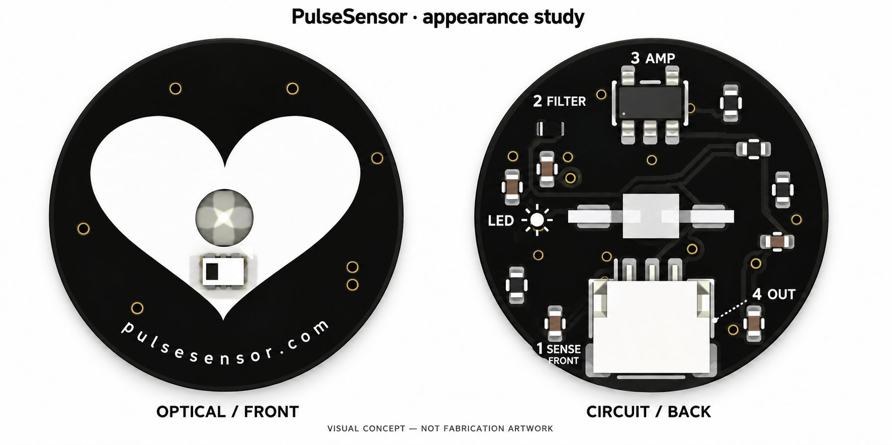

# PulseSensor front/back appearance study

DEVELOPMENT / generated visual concept only. Not fabrication artwork.

The visual reference is the verified submitted RC3 B JST board, plus the earlier black/white reconstructed heart-and-website face. The native electrical board has not been modified. The proposed front restores a broad white heart and lowercase `pulsesensor.com` on black. The back uses a numbered functional legend: sensing on the opposite face, filter, amplifier, output. LED illumination is separate.

The original logo audit did not locate original heart/URL silkscreen geometry in the historical DesignSpark/Gerber package. This image therefore represents a best-match visual reconstruction, not an exact original master. Image generation cannot certify exact component geometry, silkscreen registration, clearance, actual-size legibility, or accurate copper connectivity. A native artwork-only implementation and review are still required before manufacture; the generated image must never control fabrication.

Created with the built-in image-generation tool. The first generation had misleading explanatory arrows; the retained second concept removes the signal-chain arrows in favor of numbered stages. The prompts are preserved in `prompts.json`. No supplier message or order was made.

## Expanded teaching concept and native CAD study

The [component teaching concept](component-teaching-concept.png) adds component identities and explanations. Its R1 description is simply “Limits LED current and sets brightness.” The final image-generation specification is in [verbose-prompt.json](verbose-prompt.json).

The [editable KiCad board](native/PulseSensor-JST-Educational-Study.kicad_pcb) now contains actual front and back silkscreen artwork derived from the submitted JST source, rather than artwork existing only in a generated picture. Open the project alongside its supplied libraries and models. [Native render comparison](native/native-review.png).

- The reconstructed heart and curved website are on B.Silkscreen, the optical front. The heart is cut clear of the actual optical aperture, detector pads and existing polarity marking.
- F.Silkscreen, the circuit back, has component references and the functional words that fit: LED, AMP and OUT. Dashed guides follow existing routed signal-net centerlines, with breaks at crossings, pads, bodies and text. Both copper layers are projected onto this explanatory surface; the guides are not a complete wiring diagram. A conventional-current arrow follows the LED cathode branch toward R1.
- A larger [logical circuit drawing](native/logical-schematic.svg) is stored natively on User.1 outside the physical board. It explains the LED current branch, sensor load, coupling/filter network, feedback amplifier, reference divider and supply. This is explanatory CAD geometry, not a replacement ERC-checkable schematic.
- All component placements, pad nets, pad sizes, drills, tracks, vias, board edge and zone descriptors were compared before/after and remain unchanged, including the LED, optical detector and JST connector. The submitted source is untouched. No components were relocated in this iteration.
- Actual KiCad renders use the default green mask display. The intended appearance remains black with white artwork; render color is not a new stackup specification.

**Status: REVISE — native artwork feasibility study.** Native DRC reports zero unconnected items and no silkscreen overlap, pad/mask clipping or edge-clipping warnings. One NPTH/courtyard error also exists in the submitted source. Thirty-three text-height warnings remain: compact back lettering is 0.45 mm, below the project minimum. Full explanatory prose does not fit at readable size with the present placement. Moving parts is permitted by the current design brief, with the LED and optical window fixed, but would require a separately checked routing iteration; this study does not claim that redesign is complete.

The diagnostic gate remains REVISE. No matching native `.kicad_sch` was included in the submitted SOURCE_SUPPORT package, so ERC/parity and the full release/mechanical evidence gate are not satisfied. See [validation summary](native/validation-summary.json) and [source/geometry evidence](native/evidence.json). No fabrication package, supplier upload or order was produced.

Rebuild the native study using `build_native_study.py` with KiCad 10's bundled Python. The script includes exact source paths and hashes are recorded in the evidence. Render the board using `kicad-cli pcb render --side top` / `--side bottom`; export User.1 with `kicad-cli pcb export svg`. The schematic SVG viewport is expanded to include the off-board teaching drawing.
