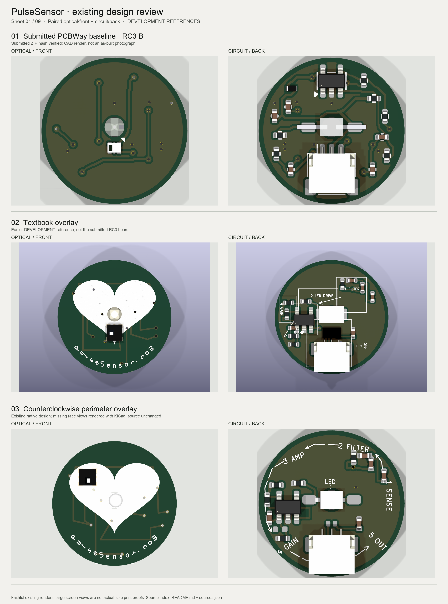
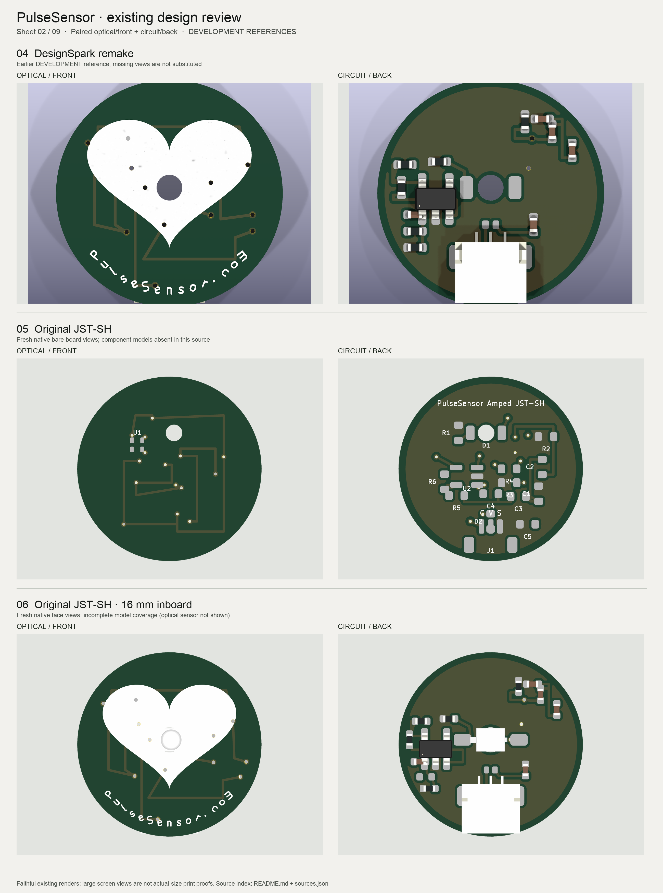
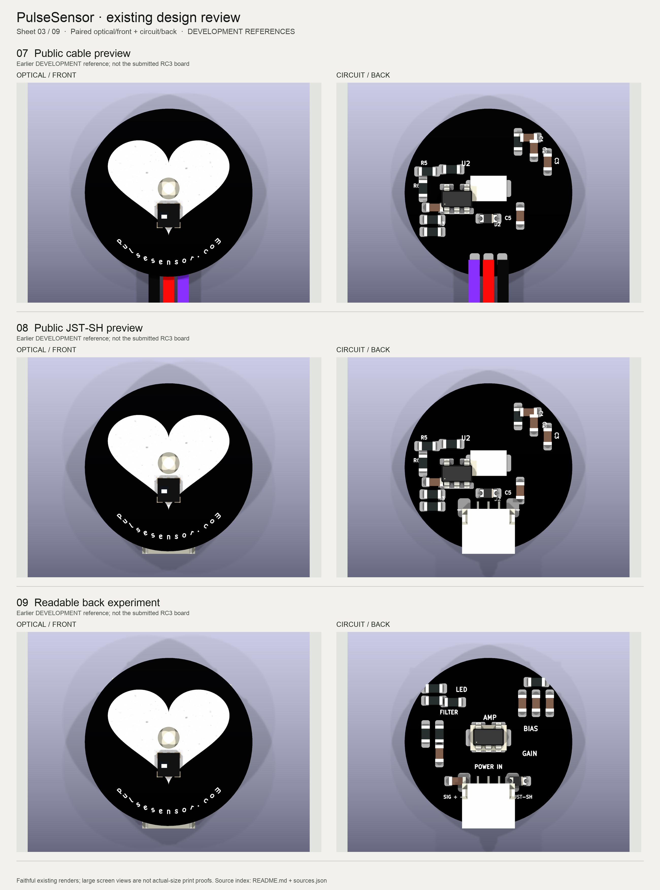
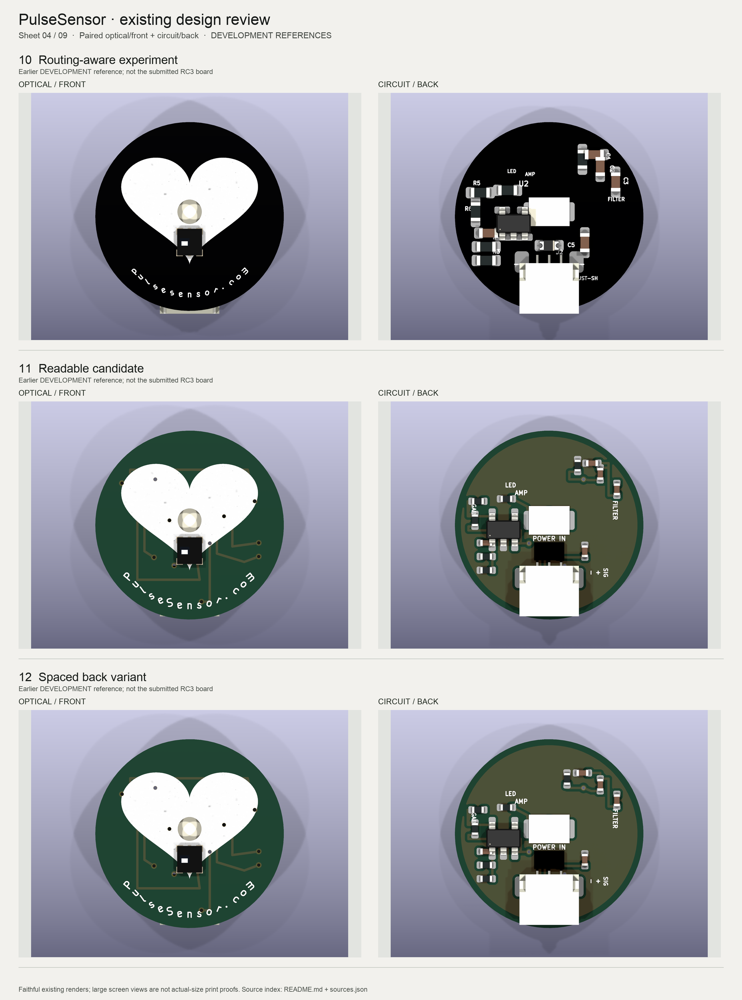
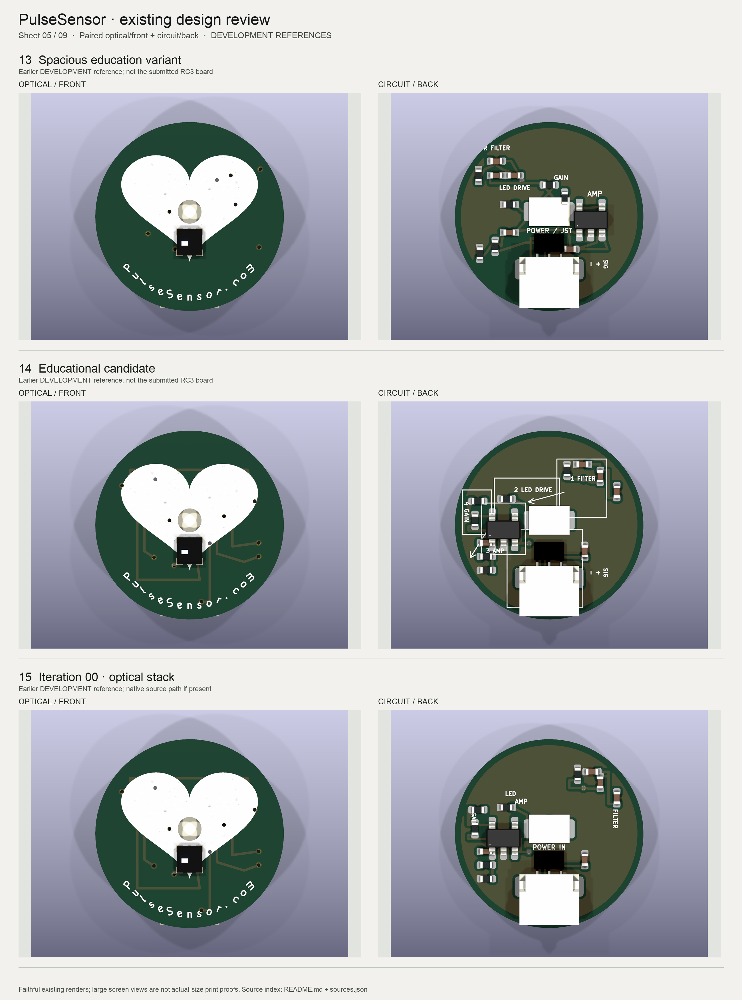
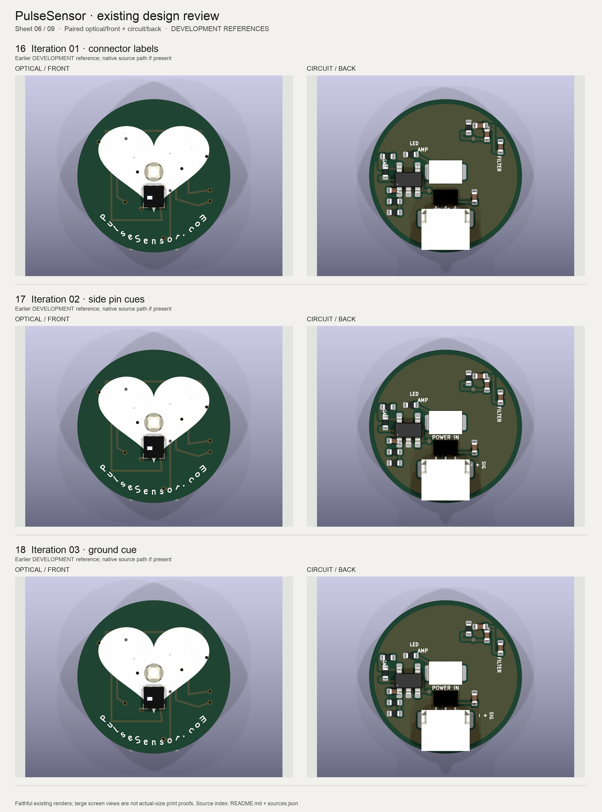
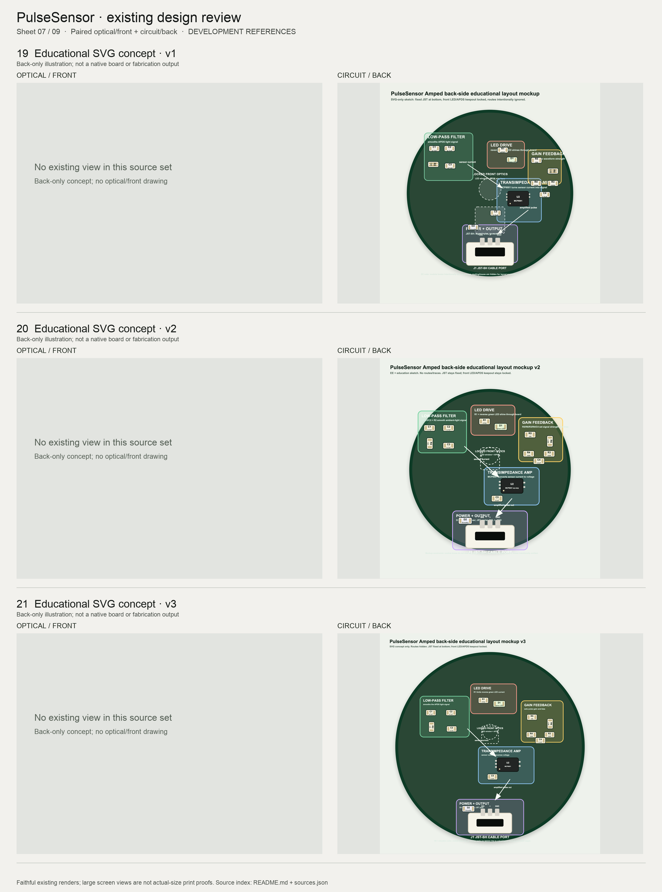
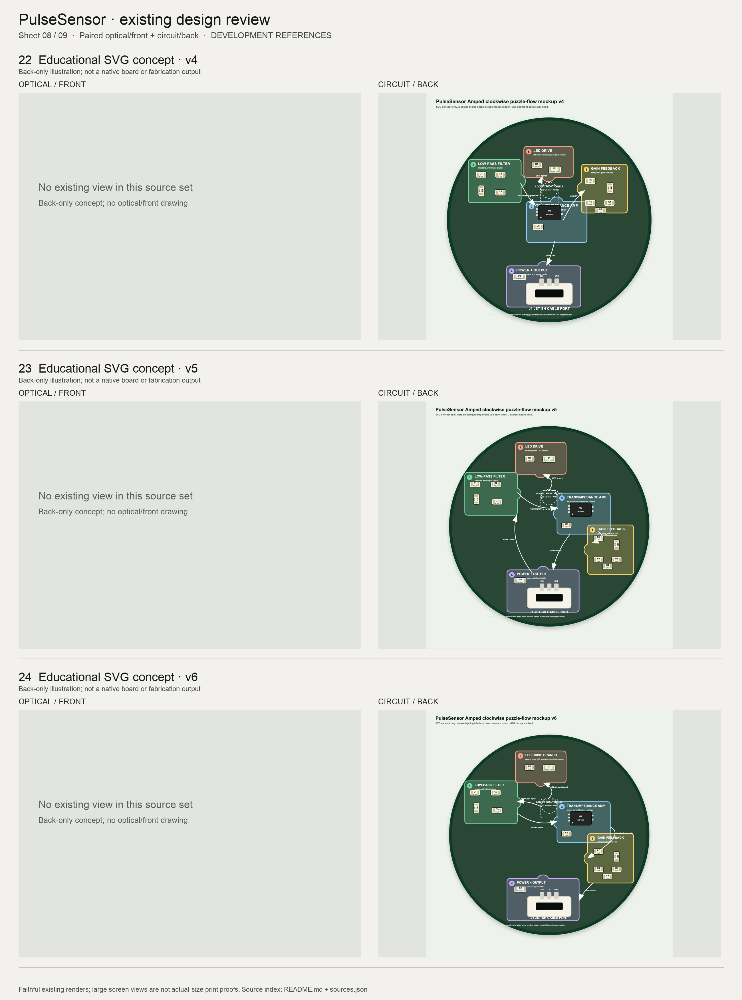
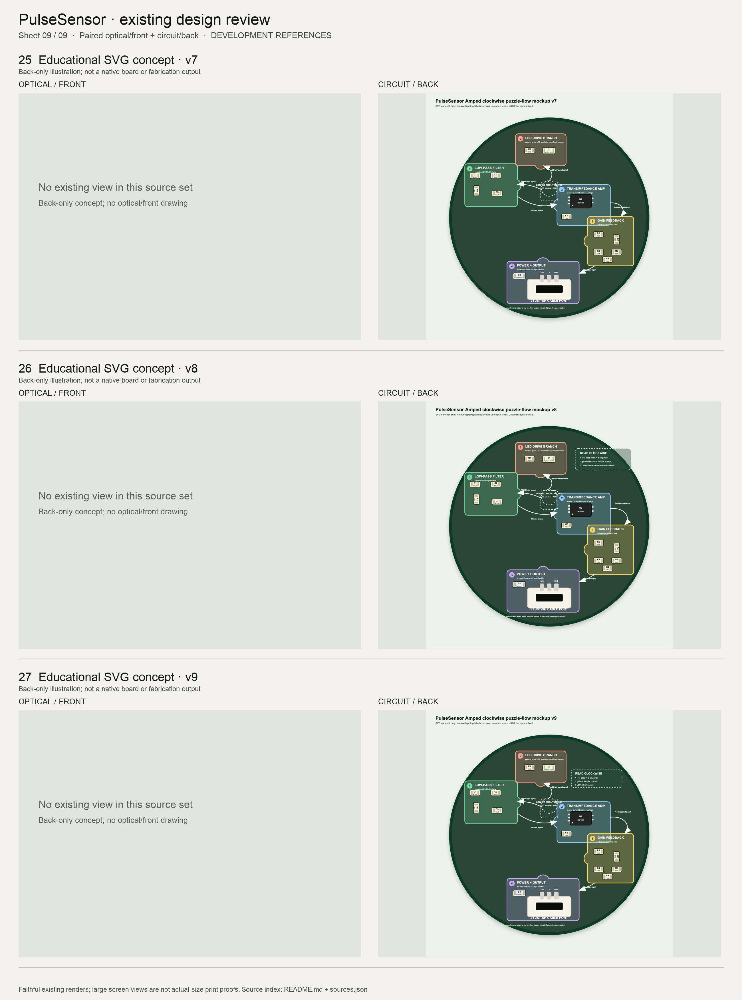

# PulseSensor design contact sheets — 2026-09-09

DEVELOPMENT / visual reference review only. No board design changes or fabrication release.

27 numbered designs, paired front/back. Missing views are labeled; no different board is substituted. The nine SVG concepts are back-only illustrations. Existing renders are resized and padded faithfully, with no crop, recoloring, or reconstruction. Render colors may differ from intended manufacturing colors.

## Contact sheets

### Sheet 01: designs 01–03

### Sheet 02: designs 04–06

### Sheet 03: designs 07–09

### Sheet 04: designs 10–12

### Sheet 05: designs 13–15

### Sheet 06: designs 16–18

### Sheet 07: designs 19–21

### Sheet 08: designs 22–24

### Sheet 09: designs 25–27

## Source index

Exact local source paths, SHA-256 hashes, source checkout revisions, tracked flags, and per-file dirty status are in [sources.json](sources.json). A checkout revision alone does not identify dirty or ignored artifacts: use the recorded file hash. Source files remain untouched.

| No. | Design | Source folder / native file |
| --- | --- | --- |
| 01 | Submitted PCBWay baseline · RC3 B | `PulseSensor-Amped-Rebuild/output/pcbway-release-candidates-RC3-R1-FINAL/PulseSensor-Amped-B-PCBWay-EVT-RC3-R1-FINAL/SOURCE_SUPPORT/PulseSensor-Amped-B-JST.kicad_pcb` |
| 02 | Textbook overlay | `Public-Online-Audit/KiCad-Public-3D-View-JSTSH-Textbook-Overlay-Variant/PulseSensorAmped_Public_Online_3D_View_JSTSH_Textbook_Overlay_Variant.kicad_pcb` |
| 03 | Counterclockwise perimeter overlay | `PCBWay-Fresh-Spin-2026-07-31-Isolated/02-counterclockwise-overlay/PulseSensorAmped_Fresh_CCW_Overlay.kicad_pcb` |
| 04 | DesignSpark remake | `KiCad-DesignSpark-Remake/PulseSensorAmped_DesignSpark_Remake.kicad_pcb` |
| 05 | Original JST-SH | `KiCad-Original-JSTSH/PulseSensorAmped_Original_JSTSH.kicad_pcb` |
| 06 | Original JST-SH · 16 mm inboard | `KiCad-Original-JSTSH-16mm-inboard/PulseSensorAmped_Original_JSTSH_16mm_inboard.kicad_pcb` |
| 07 | Public cable preview | `Public-Online-Audit/KiCad-Public-3D-View/PulseSensorAmped_Public_Online_3D_View.kicad_pcb` |
| 08 | Public JST-SH preview | `Public-Online-Audit/KiCad-Public-3D-View-JSTSH-Variant/PulseSensorAmped_Public_Online_3D_View_JSTSH_Variant.kicad_pcb` |
| 09 | Readable back experiment | `Public-Online-Audit/KiCad-Public-3D-View-JSTSH-Readable-Back-Experiment/PulseSensorAmped_Public_Online_3D_View_JSTSH_Readable_Back.kicad_pcb` |
| 10 | Routing-aware experiment | `Public-Online-Audit/KiCad-Public-3D-View-JSTSH-Routing-Aware-Experiment/PulseSensorAmped_Public_Online_3D_View_JSTSH_Routing_Aware.kicad_pcb` |
| 11 | Readable candidate | `Public-Online-Audit/KiCad-Public-3D-View-JSTSH-Readable-Production-Candidate/PulseSensorAmped_Public_Online_3D_View_JSTSH_Readable_Production_Candidate.kicad_pcb` |
| 12 | Spaced back variant | `Public-Online-Audit/KiCad-Public-3D-View-JSTSH-Spaced-Back-Variant/PulseSensorAmped_Public_Online_3D_View_JSTSH_Spaced_Back_Variant.kicad_pcb` |
| 13 | Spacious education variant | `Public-Online-Audit/KiCad-Public-3D-View-JSTSH-Spacious-Education-Variant/PulseSensorAmped_Public_Online_3D_View_JSTSH_Spacious_Education_Variant.kicad_pcb` |
| 14 | Educational candidate | `Public-Online-Audit/KiCad-Public-3D-View-JSTSH-Educational-Production-Candidate/PulseSensorAmped_Public_Online_3D_View_JSTSH_Educational_Production_Candidate.kicad_pcb` |
| 15 | Iteration 00 · optical stack | `Public-Online-Audit/Readable-Production-Design-Loops/iteration-00-fixed-optical-stack/renders/back.png` |
| 16 | Iteration 01 · connector labels | `Public-Online-Audit/Readable-Production-Design-Loops/iteration-01-connector-label-pass/renders/back.png` |
| 17 | Iteration 02 · side pin cues | `Public-Online-Audit/Readable-Production-Design-Loops/iteration-02-side-pin-cues/renders/back.png` |
| 18 | Iteration 03 · ground cue | `Public-Online-Audit/Readable-Production-Design-Loops/iteration-03-visible-ground-cue/renders/back.png` |
| 19 | Educational SVG concept · v1 | `Public-Online-Audit/Educational-SVG-Mockups/pulsesensor_back_educational_layout_mockup.svg` |
| 20 | Educational SVG concept · v2 | `Public-Online-Audit/Educational-SVG-Mockups/pulsesensor_back_educational_layout_mockup_v2.svg` |
| 21 | Educational SVG concept · v3 | `Public-Online-Audit/Educational-SVG-Mockups/pulsesensor_back_educational_layout_mockup_v3.svg` |
| 22 | Educational SVG concept · v4 | `Public-Online-Audit/Educational-SVG-Mockups/pulsesensor_back_clockwise_puzzle_flow_mockup_v4.svg` |
| 23 | Educational SVG concept · v5 | `Public-Online-Audit/Educational-SVG-Mockups/pulsesensor_back_clockwise_puzzle_flow_mockup_v5.svg` |
| 24 | Educational SVG concept · v6 | `Public-Online-Audit/Educational-SVG-Mockups/pulsesensor_back_clockwise_puzzle_flow_mockup_v6.svg` |
| 25 | Educational SVG concept · v7 | `Public-Online-Audit/Educational-SVG-Mockups/pulsesensor_back_clockwise_puzzle_flow_mockup_v7.svg` |
| 26 | Educational SVG concept · v8 | `Public-Online-Audit/Educational-SVG-Mockups/pulsesensor_back_clockwise_puzzle_flow_mockup_v8.svg` |
| 27 | Educational SVG concept · v9 | `Public-Online-Audit/Educational-SVG-Mockups/pulsesensor_back_clockwise_puzzle_flow_mockup_v9.svg` |

## Submitted baseline and reuse boundaries

Design 01 uses the render files and native supporting PCB from the submitted RC3 B archive. The local archive SHA-256 was recomputed as `0afda167b52ab0b0251cf22f91fd92fefa5dcf5e74f67b36446e7ec775acf792`; native PCB bytes were compared directly with its ZIP member. PCB SHA-256: `b439dcff82c4553731ac35ebcd27276899f8dfbbfcd35f2351d8101497eb4ad4`. This establishes archive identity, not as-built equivalence. The original manufacturing Gerbers, BOM and CPL control, rather than the supporting native file.

The submitted RC3 design has optical/front on KiCad B and circuit/back on KiCad F. Earlier versions use different conventions; the paired labels here follow their existing optical/front and circuit/back renders.

Textbook, educational-candidate, and counterclockwise versions demonstrate actual educational silkscreen graphics in native boards. These are block/flow illustrations, not a full component-symbol schematic. They are visual references on older electrical layouts. Their pin maps, geometry, topology and values must not replace the RC3 working baseline. The July counterclockwise folder explicitly declares itself non-authoritative and not for fabrication.

The old white heart and website geometry is photo-reconstructed artwork, not a recovered original silkscreen export (see `Original-Review/original_logo_source_audit.md` in the source checkout). No new artwork or board changes were made for this review.

## Reproduce

Run `build_contact_sheets.py` using Python with Pillow. It reads the approved WFE source checkout paths defined at the top and writes only this review directory. The source hashes record the exact visual inputs used. No email content or supplier correspondence is included.

## Render QA and limitations

All nine sheets were visually reviewed. Five missing/incorrectly named face views were rendered from unchanged existing native boards using KiCad; exact commands and before/after source-hash checks are in `rendered-missing-views/render-evidence.json`. Design 05 has no component models; design 06 has incomplete optical-sensor model coverage. These are source limitations, not assembly instructions. Design 04 also has incomplete legacy model coverage. No missing parts were invented. All native sources remain byte-for-byte unchanged.

## Added artwork, routing and power/color revisions

Original sheets 01–09 remain unchanged. This appendix adds corrected teaching artwork, retained native routing/artwork milestones, and the enlarged-front / color-print candidates. Metadata-helper failures are explicitly labeled. All partial routing checkpoints remain linked in the local visual ledger.

[sheet-10.png](sheet-10.png)

[sheet-11.png](sheet-11.png)

[sheet-12.png](sheet-12.png)

[sheet-13.png](sheet-13.png)

[sheet-14.png](sheet-14.png)

[sheet-15.png](sheet-15.png)

[sheet-16.png](sheet-16.png)

[sheet-17.png](sheet-17.png)

[sheet-18.png](sheet-18.png)

[sheet-19.png](sheet-19.png)

[Current review](../power-color-2026-09-09/review.html) · [All routing attempts and native revision history](../sendoff-candidate-2026-09-09/visual-log/index.html)

### Final selected comparison — sheet 20

[Sheet 20](sheet-20.png) adds the final color-10 candidate. Color-09 on sheet 19 is superseded; its brown optical-front rendering is a retained renderer defect, not intended solder mask. Color-10 still encounters KiCad mixed-mask rendering limitations; the shared black optical-face design is shown from verified mono-08.

## Packaging postcard milestone — 2026-09-10

[Sheet 21](sheet-21.png) shows both 4-inch insert faces: PCB/reference BOM and matching schematic. [Print files and source](../postcard-insert-2026-09-10/README.md). The color-10 board back is accepted as a major milestone; front board graphics are deferred. No hardware geometry changed.

## Complete schematic companion — 2026-09-10

[Sheet 22](sheet-22.png) adds a separate 4-inch card with the complete circuit and a six-part reading guide. [Print files, source and preserved draft](../schematic-companion-2026-09-10/README.md). The first PCB/BOM card and all hardware remain unchanged.

## Puzzle module alternative — 2026-09-10

[Sheet 23](sheet-23.png) compares accepted color-10 with interlocking solid-color functional areas. [Vector study and revision record](../puzzle-modules-2026-09-10/README.md). No hardware changes.

## Dotted module alternative — 2026-09-10

[Sheet 24](sheet-24.png) compares accepted color-10 with straight solid-color functional areas with black dotted boundaries. [Vector study and revision record](../module-outlines-2026-09-10/README.md). No hardware changes.

## Full-color full schematic retail purchase card — 2026-09-10

[Sheet 25](sheet-25.png) adds a separate 4-inch card with the complete circuit and a parts schedule. [Print files, source and preserved draft](../full-color-retail-card-2026-09-10/README.md). The first PCB/BOM card and all hardware remain unchanged.

## Brand unification — 2026-09-10

[Sheet 26](sheet-26.png) shows matching website-sourced salmon and neutral colors on the board and both purchase-card faces. [Palette evidence, print PDFs and color-only checks](../brand-unification-2026-09-10/README.md). All earlier geometry and text preserved.
